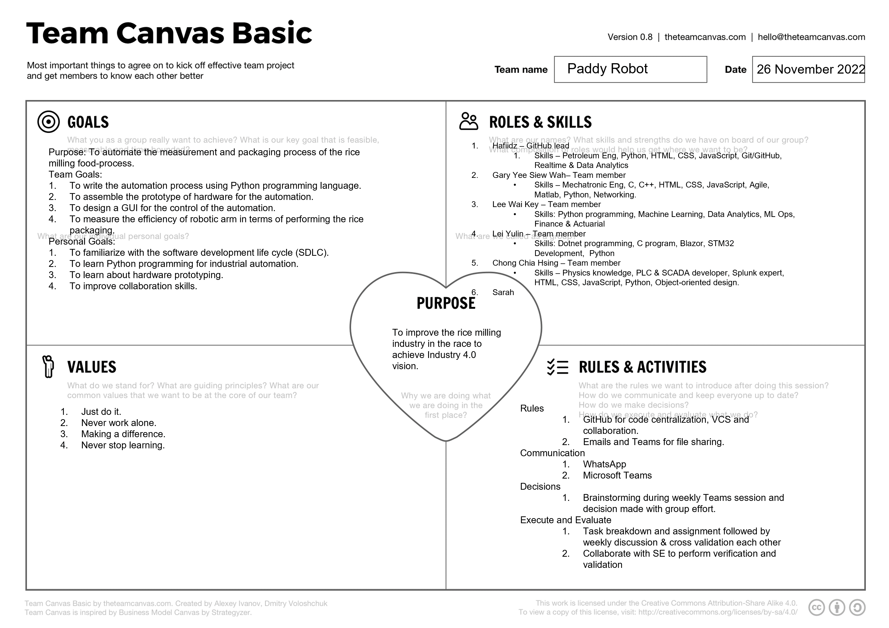
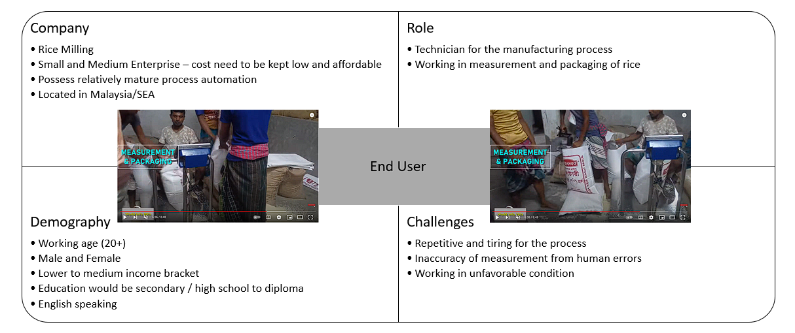

# Group Name - PaddyRobot

The aim of the project is to automate the measurement and packaging of the rice process in the rice milling manufacturing plant using robotic arm.

## Team Canvas

</img>

## Group Logo

</img>

## Group Photo

</img>
</img>
</img>
</img>
</img>

## Links

- [Group Information](./group_information/Group.md)

## Discussion Notes

- [Week 5 Discussion](./discussions/week5discussion.md)
- [Week 6 Discussion](./discussions/week6discussion.md)
- [Week 7 Discussion](./discussions/week7discussion.md)
- [Week 8 Discussion](./discussions/week8discussion.md)
- [Week 9 Discussion](./discussions/week9discussion.md)
- [Week 10 Discussion](./discussions/week10discussion.md)

## FILA Form

- [Week 5 and 6](./resources/FILA_FORM_Week5_6_v1.docx)
- [Week 7 and 8](./resources/FILA_FORM_Week7_8_v1.docx)
- [Week 9 and 10](./resources/FILA_FORM_Week9_10_v1.docx)
- [Week 11 and 12](./resources/FILA_FORM_Week11_12_v1.docx)

## End User Persona

</img>

## Define Problems

- Heavy workload and not ergonomic to human.
- Accuracy and reliability of the process is low.
- If no automation is implemented, packaging efficiency is low.
- Not hygienic due to human involvement.
- Existing packaging technology or tool occupy large spaces and does not provide modularity or mobility for integration with other automation.

## List of resources related to problem

- The repetitive process can be automated to improve the working environment, however, such structural change would also generate new issue to be resolved. One of them, as mentioned article [Human Factors and Ergonomics in Automation Design](./resources/LeeSeppelt_2012_Humanfactorsandergonomicsinautomationdesign.pdf), "Automation often fails to provide expected benefits because it does not simply replace the human in performing a task but also transforms the job and introduces new tasks."
- Food packaging automation can improve, safety, productivity, flexibility, scalability, operating cost, consistency of production, and end-to-end traceability of the process. [Automation in The Food Packaging Industry – Trends and Benefits](https://www.pwrpack.com/food-packaging-automation/)
- The [DCS Series Rice Packing Machine](https://rice-processing.com/dcs-series-rice-packing-machine.html) shows that the rice packing has a dimension of more than 700 $*$ 600 $*$ 2500 mm and it also requires extra equipment to transport the rice, [Bucket Elevator](https://rice-processing.com/dtg-series-bucket-elevator.html).

## Literature Review - Papers

1. Design and performance of a robotic arm for farm use - Retrieved by Gary
2. Energy efficiency in the robot arm using genetic algorithm - Retrieved by Gary
3. Robotic arm movement optimization using soft computing - Retrieved by Gary

## Software Requirement Specification (SRS)

1. Submitted the first draft to the SE team - 12 December 2022
   - [SRS Version 1.2.2](./resources/SRS_v1.docx)
   - [SRS Version 1.2.4](./resources/SRS_v1.2.4.docx)
   - [SRS Version 2.0.2](./resources/WOA7001_G1_PaddyRobot_SRS_v2.0.2.pdf)

## Optimization

1. Knapsack - [Python Notebook](./notebooks/notebook_knapsack_1.ipynb)
